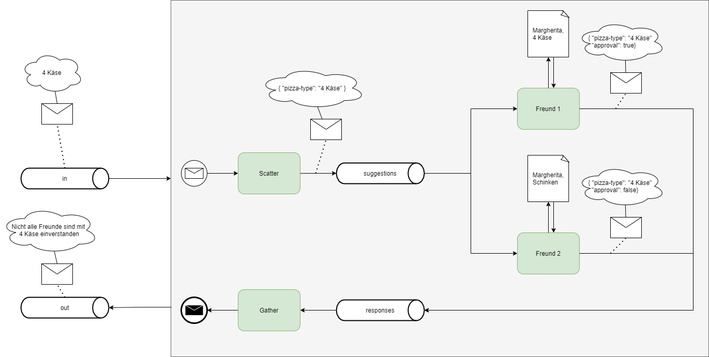

# pizza-party
Which pizza type do all services agree on? An Apache Camel Project for pizza selection among microservices using the [scatter-gather](https://www.enterpriseintegrationpatterns.com/patterns/messaging/BroadcastAggregate.html) EIP.

Imagine you meet up with a few friends, and you have to order pizza.
However, you and your friends have different pizza preferences. 
One way to select a pizza is to make a suggestion and aggregate each friend's response.
Unfortunately, in this scenario you cannot communicate with your friends in common channels, such as personally or through social media.
Fortunately, your friends have lists of favourite pizza types and can build Camel routes that consume suggestions from a Kafka topic and respond in another Kafka topic.
Unfortunately, they don't have time to build the routes, so you have to build them. 
Your friends provide lists of their favourite pizza types though.

To build the whole system feel free to start from [exercise](exercise).

To explore one way to build the system feel free to browse [solution](solution).

## System

The system consists of the following components.

### Kafka with four topics:
- in: suggestions are written here
- suggestions: internal topic for the messages scattered to the friend routes
- responses: internal topic for the friend responses
- out: messages here tell you if all friend approve of the suggested pizza

### Quarkus service with dour Camel routes:
- Scatter: consuming suggestions, e.g. "4 Käse" and sending them in the aligned message format `{ "pizza-type": string }` to the friend routes
- 2 friend routes: consuming suggestions, checking if the suggestion is part of the preferred pizza types and responding in the aligned message format `{ "pizza-type": string, "approval": boolean}` 
- Gather: aggregating the responses of all friends and producing a corresponding message to the output topic in a human-friendly way, e.g. "Nicht alle Freunde sind mit 4 Käse einverstanden"

### Overview


### Starting, trying out and stopping Kafka

1. Start containers and create topics
```
$ docker compose up -d

[+] Running 4/4
 - Network pizza-party_default        Created                                                                                                                                                                                      0.0s
 - Container pizza-party_zookeeper_1  Started                                                                                                                                                                                      0.6s
 - Container pizza-party_kafka_1      Started                                                                                                                                                                                      1.4s
 - Container kafka-create-topics      Started  
```

2. After a few seconds the topics schould be created:
```
$ docker exec pizza-party_kafka_1 kafka-topics --list --bootstrap-server localhost:29092

in
out
responses
suggestions
```

3. Producing messages

To produce a message in the topic "in":
- open the console producer for this topic
- enter a message, for example "hello", and press enter
- exit the console producer with ctrl+c
```
$ docker exec -it pizza-party_kafka_1 kafka-console-producer --topic in --bootstrap-server localhost:29092

>hello
>^C
```

4. Reading Messages

To read a message from the topic "in", where the message "hello" was produced in the previous step:
- open the console consumer for this topic
- see the messages
- exit the console conszmer with ctrl+c
```
$ docker exec pizza-party_kafka_1 kafka-console-consumer --topic in --bootstrap-server localhost:29092 --from-beginning

hello

```

5. Shut the containers down
```
$ docker compose down

[+] Running 4/4
 - Container kafka-create-topics      Removed                                                                                                                                                                                     11.0s
 - Container pizza-party_kafka_1      Removed                                                                                                                                                                                      5.4s
 - Container pizza-party_zookeeper_1  Removed                                                                                                                                                                                      1.7s
 - Network pizza-party_default        Removed
```